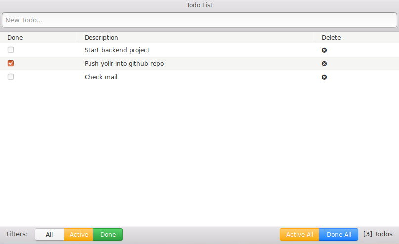

Yollr
=========

A very basic todo app build with React (and Redux).

Screenshots
---


How to install
---

This app is based on [Node.js](http://nodejs.org/). It uses [Redux](https://redux.js.org/) and [Photon](http://photonkit.com/).

Clone or Download this repository.
```
git clone https://github.com/arasT/yollr
```
Extract the archive file and move into it.
```
cd yollr
```
Install all node modules.
```
npm install
```

Run the app
---

Just launch one of the commands bellow.

```
npm start
```

It will open a browser and display the home page at: http://localhost:3000.

License
----

The MIT License.
Further details see LICENSE file.

Contributing
----

Please fork if you want to contribut to this project.
